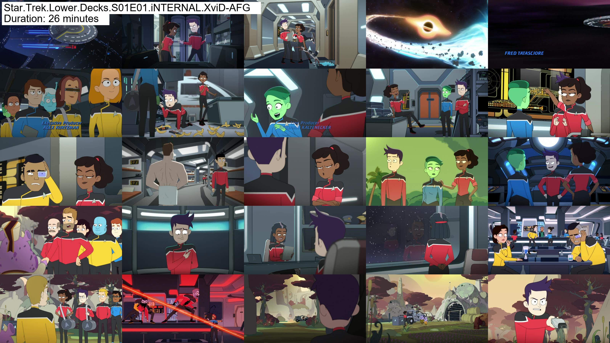

# Video Screenshot Grid Maker (VSGM)

Create a jpg file containing screenshots from a video presented in a grid.

# Table of Contents

- [1. Usage](#1-usage)
   - [1.1 How to use wizard](#11-how-to-use-wizard)
   - [1.2 Scan a specific folder](#12-scan-a-specific-folder)
   - [1.3 Example grid](#13-example-grid)
- [2. Usage](#2-faq)
   - [2.1 Error in UnicodeEncode](#21-error-in-unicodeencode)
- [3. Information](#3-information)
   - [3.1 License](#31-license)
   - [3.2 Contributors](#32-authors)

# 1. Usage

## 1.1 How to use wizard

Execute the vsgm.py file and it will ask you for a drive name, then you can select what folder to scan for video files.

    python vsgm.py

The script will scan the folder you chose and its subfolders for video files, and create screenshot grids with the same name.

## 1.2 Scan a specific folder

You can execute the script by adding the folder to scan for videos as a parameter.

    python vsgm.py e:\my-videos

## 1.3 Example grid

</img>

# 2. FAQ

## 2.1 Error in UnicodeEncode

If you get an error dealing with UnicodeEncoding errors like:

    File "C:\Python311\Lib\encodings\cp1252.py", line 19, in encode  
    UnicodeEncodeError: 'charmap' codec can't encode character '\u0440' in position 59: character maps to <undefined>

Run the following command in terminal to make sure you are using UTF-8 which has all of the unicode characters.

    export PYTHONIOENCODING=utf-8  

# 3. Information

## 3.1 License

This project is licensed under the terms of the  [MIT](http://www.opensource.org/licenses/mit-license.php) License. Enjoy!

## 3.2 Author

Kim Steinhaug: [@steinhaug](http://twitter.com/steinhaug) [LinkedIn](https://no.linkedin.com/in/steinhaug) [Website](http://steinhaug.no/)
